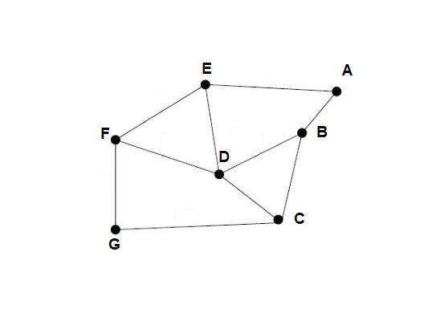

# Apresentar uma função __booleana__ GRAPHCheckTrail que verifica uma da sequência seq[0..k] de vértices de um grafo é uma trilha.

## Integrantes: Elkem Balieiro, Daniel Lobato, Caio Jucá & Marcos Taylon.

Para resolver tal exercício, é essencial saber o que é uma trilha em grafo.

Primeiramente tem-se que saber o que é uma aresta e um vétice. Um vértice (ou nó para os íntimos) é a parte mais básica de um grafo. Em um grafo desenhado, o vértice será a bolinha. Já as arestas são as uniões dos vértices. Em grafo desenhado, as arestas serão as linhas (ou caminhos) traçadas.

Um __passeio__ é um sequência alternada de vértices e arestas que começa e termina com vértices. Em um passeio pode haver repetições de vértices e arestas.

Diante disso, pode-se dizer que uma trilha (**trail**) é um passeio que não há repetições de **arestas**.

### Algoritmo de resolução:

Para resolver o exercício, primeiro foi feito a etapa de criação do grafo, dos vértices e das arestas. Para isso, foi reaproveitado o código da [prática02](https://github.com/balieiroElkem/Teoria-dos-grafos/tree/main/pratica02/src/main/java). Com o código pronto, basta inserir os vértices e arestas que desejar.

#### Funcionamento do algoritmo da função __graphCheckTrail__:

A função tem como parâmentro uma string que é a sequência de vértices do passeio especificado. Para cada par de letras, é verificado se existe na lista de vértices. Nesse caso, uma aresta vai ser o conjunto de __letra e letra+1__. É criado um mapeamento do tipo __HashMap<>()__ para verificar se a aresta já foi contabilizada. Caso essa a aresta exista no map, o programa set a variável __isTrail__ com __false__ e sai do loop para retornar a classe principal. Se a aresta não existe no map, ela é adicionada. É verificado também se existe essa aresta. Por exemplo, AD não se ligam, logo eles não são arestas. Essa verficação é feito no primeiro __if__. E caso eles não sejam arestas, é exibido uma mensagem na tela e o valor __isTrail__ é setado como __false__.

A função está no arquivo [Grafo.java](src/main/java/grafo/core/Grafo.java).

